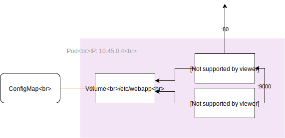
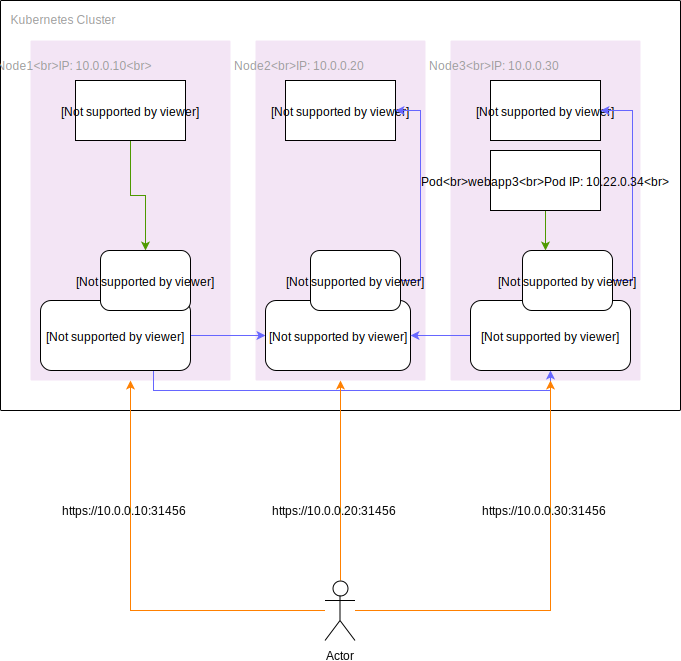

# Introduction to Kubernetes

----

## Marcel D. Juhnke

#### SRE @ GfK

---
## What is Kubernetes?

The website says

> Kubernetes (k8s) is an open-source system for automating deployment, scaling, and management of containerized applications.

----

## Why is that important?

You usually don't manually want to

* pick the server your app is running on
* make sure all replicas are running the same version
* configure a Load Balancer to add new endpoints
* restart your app in case of errors

... the list goes on

---

## Core Task -> Scheduling Pods (Containers)

----

#### A Kubernetes Cluster consists of

* Master node(s)
* Worker nodes

----

## Kubernetes masters

Those contain all the components required for managing a cluster

* API Server
* Scheduler
* Controllers

Together, those manage all the workloads in the cluster

----

## (Worker) Nodes

Here we have three main components

* container runtime (most often Docker)
* kubelet
* kube-proxy

---

## Basic objects

Minimal set of basic objects

* Nodes
* Pods
* Services

---

## Nodes

Run workloads (obviously)


---

## Pods

* Core object
* Everything revolves around Pods
* Smallest deployable object

----

## Pods

* Single application instance per Pod
* Contains one or more containers
* Containers share volumes and network namespace
* For multiple instances -> create multiple identical Pods

----


----


----

```yaml
apiVersion: apps/v1
kind: Pod
metadata:
  name: nginx
  labels:
    app: nginx
spec:
  containers:
  - name: nginx
    image: nginx:1.7.9
    ports:
    - containerPort: 80
      name: http
  - name: wordpress
    image: wordpress:5.1
    ports:
    - containerPort: 9000
      name: php-fpm
```

----

## Volumes

* Ephemeral Volumes
* Persistent Volumes
* ConfigMaps
* Secrets

----


----



----

## ConfigMap

```yaml
apiVersion: v1
data:
  backend.properties: |
    secret.code.allowed=true
    secret.code.lives=30
  ui.properties: |
    color.good=purple
    color.bad=yellow
    allow.textmode=true
    how.nice.to.look=fairlyNice
kind: ConfigMap
metadata:
  name: webapp-config
  namespace: default

```
----


----

```yaml
apiVersion: apps/v1
kind: Pod
metadata:
  name: nginx
  labels:
    app: nginx
spec:
  volumes:
  - name: config-volume
    configMap: 
      name: webapp-config
  containers:
  - name: nginx
    image: nginx:1.7.9
    ports:
    - containerPort: 80
    volumeMounts:
      - name: config-volume
        mountPath: /etc/webapp
```

---

## Scheduler

Decides where to place Pods based on their specs

* Resource requests/limits
* Affinitys

----


---
## Deployments

* Declarative updates/rollbacks for Pods
* Manages ReplicaSets -> identical Pods

----


----


----


----


----


----

```yaml
apiVersion: apps/v1
kind: Deployment
metadata:
  name: nginx-deployment
spec:
  selector:
    matchLabels:
      app: nginx
  replicas: 2 # tells deployment to run 2 pods matching the template
  template:
    metadata:
      labels:
        app: nginx
    spec:
      containers:
      - name: nginx
        image: nginx:1.7.9
        ports:
        - containerPort: 80
          name: http
      - name: wordpress
        image: wordpress:5.1
        ports:
        - containerPort: 9000
          name: php-fpm
```

---


## Services

* Abstraction layer above Pods
* Discovery
* Load Balancing

----

* Pods can restart any time due to deployments and errors
* Scheduler can place them randomly
* Clients don't want to care where Pods are running

----


----


----

## Service Networking

* Services implement a virtual IP 
* each Service is reachable on each node
* kube-proxy configures iptables NAT rules
* kube-proxy transparently forwards traffic between nodes

----


---

## Client access

----

Until here, everything was within the cluster.

How do we get external traffic inside?

----

## Node Port Services


----

## kube-proxy



----

## Load Balancer


----

## Ingress


----


---

## Thank you for your time!
