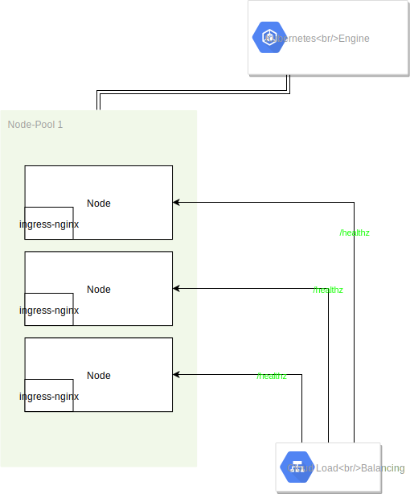
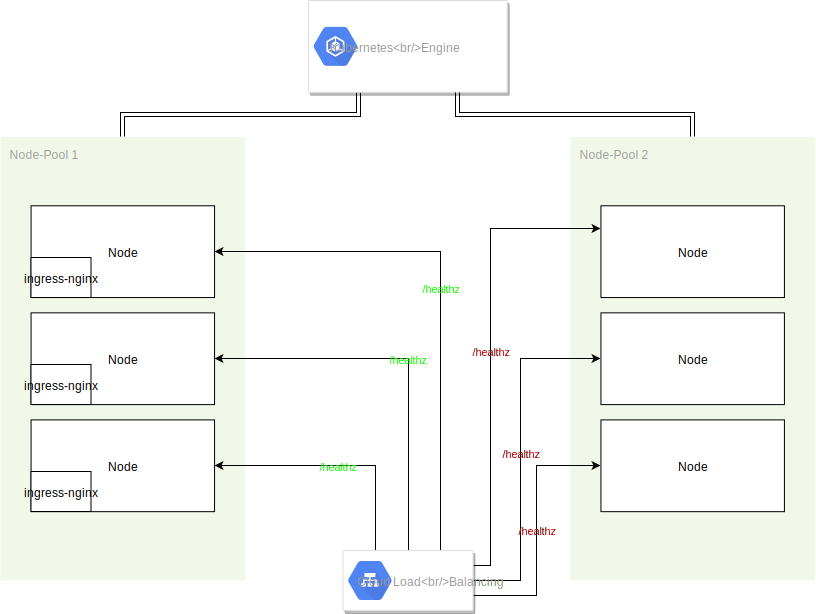
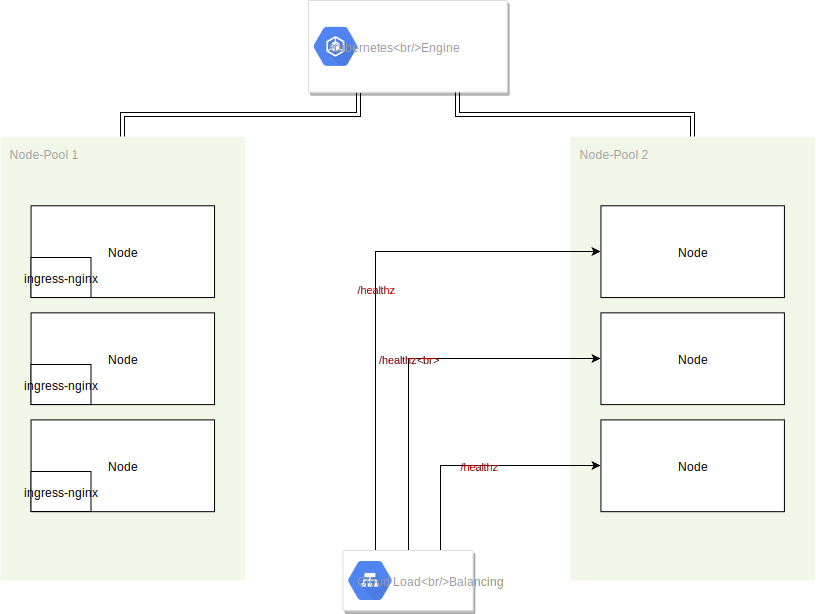
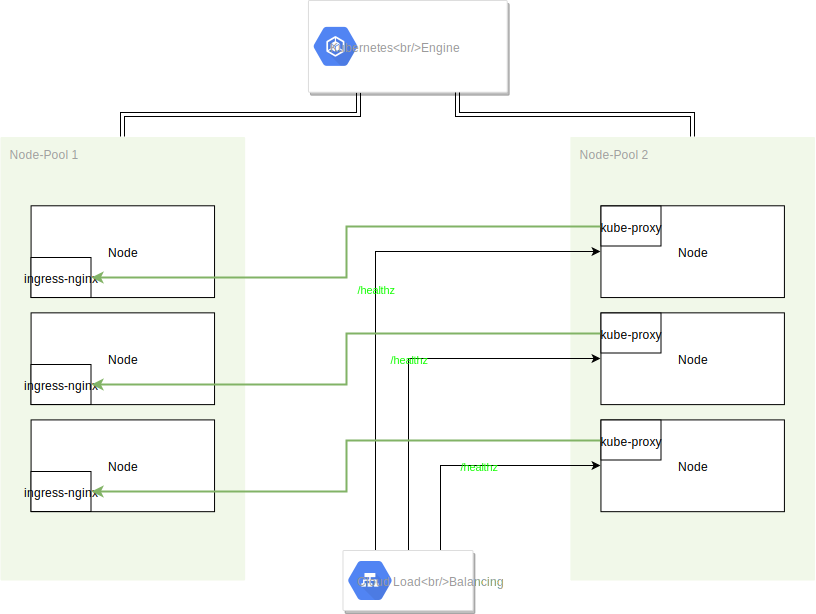
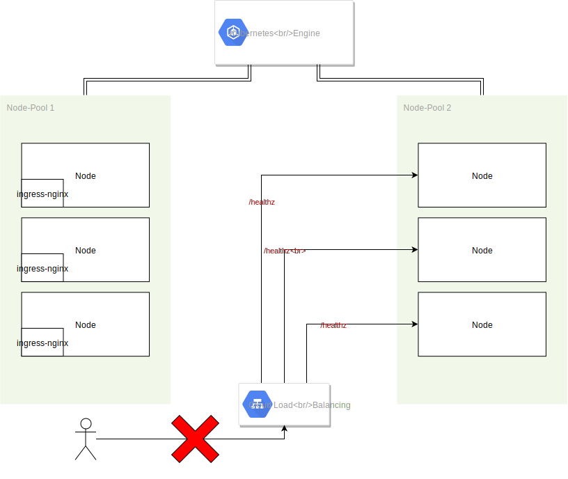

## Kubernetes Load Balancers 

#### Beware when draining nodes!


----

## Marcel Juhnke

#### SRE @ karrieretutor.de

----

## Easy migrations

#### Scheduler 
controls Pod placement

#### Node drain 
* moves Pods from the drained nodes to healthy ones
* good for planned maintanence work (replacing/upgrading nodes)

---

### What if the migration goes wrong?

----

#### before



----
#### added second node pool



----
#### `kubectl drain`

 
<div class="what">???</div>

----
After `kubectl drain` cordoned the old nodes, the Kubernetes Service Controller

* added the new nodes to the GCP Load Balancer backend config
* removed the old node from the GCP Load Balancer backend config

Nodes that are not `Ready` get removed from the Load Balancer config

----

```go
func getNodeConditionPredicate() corelisters.NodeConditionPredicate {
	return func(node *v1.Node) bool {
		// We add the master to the node list, but its unschedulable.  So we use this to filter
		// the master.
		if node.Spec.Unschedulable {
			return false
        }

        ...

        for _, cond := range node.Status.Conditions {
			// We consider the node for load balancing only when its NodeReady condition status
			// is ConditionTrue
			if cond.Type == v1.NodeReady && cond.Status != v1.ConditionTrue {
				klog.V(4).Infof("Ignoring node %v with %v condition status %v", node.Name, cond.Type, cond.Status)
				return false
			}
		}
        return true
    }
}
```
<p class="footnote">
https://github.com/kubernetes/kubernetes/blob/00eab3c40bcda9ee73eac060242d36602e627fec/pkg/controller/service/service_controller.go#L592https://github.com/kubernetes/kubernetes/blob/00eab3c40bcda9ee73eac060242d36602e627fec/pkg/controller/service/service_controller.go#L588
</p>


----
#### ingress-nginx still running on old nodes

Nodes didn't get drained due to Pod disruption budgets.

<p class="footnote">
Kubernetes will respect the PodDisruptionBudget and ensure that only one pod is unavailable at any given time. Any drains that would cause the number of ready replicas to fall below the specified budget are blocked:
<br />
<br />
https://kubernetes.io/docs/tasks/administer-cluster/safely-drain-node/#draining-multiple-nodes-in-parallel
</p>

----

However, this shouldn't be a problem.

----
# But still

No more traffic reached the ingress-nginx Pods


---
### `kube-proxy`

Our situation


----
### `kube-proxy`

This happens normally:



----
However, it didn't in our case.

---

```yaml
kind: Service
apiVersion: v1
metadata:
  name: ingress-nginx
  namespace: ingress-nginx
  labels:
    app.kubernetes.io/name: ingress-nginx
    app.kubernetes.io/part-of: ingress-nginx
spec:
  externalTrafficPolicy: Local
  type: LoadBalancer
```

----
```yaml
spec:
  externalTrafficPolicy: Local
```

> <p class="footnote">However, if you’re running on Google Kubernetes Engine/GCE, setting the same service.spec.externalTrafficPolicy field to Local forces nodes without Service endpoints to remove themselves from the list of nodes eligible for loadbalanced traffic by deliberately failing health checks.</p>

<p class="footnote">https://kubernetes.io/docs/tutorials/services/source-ip/#source-ip-for-services-with-type-loadbalancer</p>

<p class="footnote">https://github.com/kubernetes/kubernetes/blob/139a13d312b1b11de7f3af63d9503365ff3a1e6a/pkg/proxy/healthcheck/healthcheck.go#L212</p>


----
Which exactly leads to this situation

 

----
And after cordoning the nodes to this

 

---

## Second slide

> Best quote ever.

Note: speaker notes FTW!